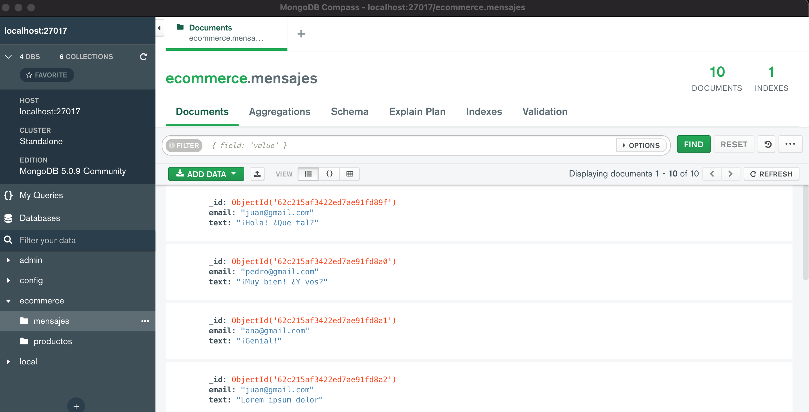

# Lista de comandos utilizados

- Para crear la base de datos

```console
use ecommerce
```

- Para crear las colecciones

```console
db.createCollection('productos')
db.createCollection('mensajes')
```

1. Agregar 10 documentos con valores distintos a las colecciones ‘mensajes’ y ‘productos’.
2. Definir las claves de los documentos en relación a los campos delas tablas de esa base. En el caso de los productos, poner valores al campo precio entre los 100 y 5000 pesos (eligiendo valores intermedios, ej: 120, 580, 900, 1280, 1700, 2300, 2860, 3350, 4320, 4990).

Para insertar algunos productos:
```console
db.productos.insertMany([
    {
        "timestamp": ISODate(),
        "title": "Product 1",
        "price": 120,
        "description":"Some description for product 1",
        "code": "XP-1",
        "image": "someUrlProduct1.com",
        "stock": 100
    },
    {
        "timestamp": ISODate(),
        "title": "Product 2",
        "price": 580,
        "description":"Some description for product 2",
        "code": "XP-2",
        "image": "someUrlProduct2.com",
        "stock": 200
    },
    {
        "timestamp": ISODate(),
        "title": "Product 3",
        "price": 900,
        "description":"Some description for product 3",
        "code": "XP-3",
        "image": "someUrlProduct3.com",
        "stock": 300
    },
    {
        "timestamp": ISODate(),
        "title": "Product 4",
        "price": 1280,
        "description":"Some description for product 4",
        "code": "XP-4",
        "image": "someUrlProduct4.com",
        "stock": 400
    },
    {
        "timestamp": ISODate(),
        "title": "Product 5",
        "price": 1700,
        "description":"Some description for product 5",
        "code": "XP-5",
        "image": "someUrlProduct5.com",
        "stock": 500
    },
    {
        "timestamp": ISODate(),
        "title": "Product 6",
        "price": 2300,
        "description":"Some description for product 6",
        "code": "XP-6",
        "image": "someUrlProduct6.com",
        "stock": 600
    },
    {
        "timestamp": ISODate(),
        "title": "Product 7",
        "price": 28600,
        "description":"Some description for product 7",
        "code": "XP-7",
        "image": "someUrlProduct7.com",
        "stock": 700
    },
    {
        "timestamp": ISODate(),
        "title": "Product 8",
        "price": 3350,
        "description":"Some description for product 8",
        "code": "XP-8",
        "image": "someUrlProduct8.com",
        "stock": 800
    },
    {
        "timestamp": ISODate(),
        "title": "Product 9",
        "price": 4320,
        "description":"Some description for product 9",
        "code": "XP-9",
        "image": "someUrlProduct9.com",
        "stock": 900
    },
    {
        "timestamp": ISODate(),
        "title": "Product 10",
        "price": 4990,
        "description":"Some description for product 10",
        "code": "XP-10",
        "image": "someUrlProduct10.com",
        "stock": 1000
    }
]);
```

Para insertar algunos mensajes:
```console
db.mensajes.insert([
  { email: 'juan@gmail.com', text: '¡Hola! ¿Que tal?' },
  { email: 'pedro@gmail.com', text: '¡Muy bien! ¿Y vos?' },
  { email: 'ana@gmail.com', text: '¡Genial!' },
  { email: 'juan@gmail.com', text: 'Lorem ipsum dolor' },
  { email: 'ana@gmail.com', text: 'Consectetur adipiscing' },
  { email: 'pedro@gmail.com', text: 'Sed scelerisque molestie eros' },
  { email: 'juan@gmail.com', text: 'Curabitur et dictum' },
  { email: 'ana@gmail.com', text: 'Donec maximus fermentum' },
  { email: 'pedro@gmail.com', text: 'Proin feugiat' },
  { email: 'juan@gmail.com', text: 'Donec sit amet' },
])
```

3. Listar todos los documentos en cada colección

```console
db.productos.find({})
db.mensajes.find({})
```

4. Mostrar la cantidad de documentos almacenados en cada una de ellas:

```console
db.productos.countDocuments({})
db.mensajes.countDocuments({})
```

5.a. Agregar un producto más en la colección de productos:

```console
db.productos.insertOne({
        "timestamp": ISODate(),
        "title": "Product 11",
        "price": 3860,
        "description":"Some description for product 11",
        "code": "XP-11",
        "image": "someUrlProduct11.com",
        "stock": 1100
    })
```

5.b.i. Listar los productos con precio menor a 1000 pesos:

```console
db.productos.find({price: {$lt: 1000}})
```

5.b.ii. Listar los productos con precio entre los 1000 a 3000 pesos:

```console
db.productos.find({
  $and: [
    { price: { $gt: 1000 } },
    { price: { $lt: 3000 } }
  ]
})
```

5.b.iii. Listar los productos con precio mayor a 3000 pesos:

```console
db.productos.find({price: {$gt: 3000}})
```

5.b.iv. Realizar una consulta que traiga sólo el nombre del tercer producto más barato:

```console
db.productos.find({},{title:1, _id:0}).sort({price:1}).skip(2).limit(1)
```

5.c. Hacer una actualización sobre todos los productos, agregando el campo stock a todos ellos con un valor de 100:

```console
db.productos.updateMany({}, {$inc: {stock: 100}})
```

5.d. Cambiar el stock a cero de los productos con precios mayores a 4000 pesos:

```console
db.productos.updateMany({price: {$gt: 4000}}, {$set: {stock: 0}})
```

5.e. Borrar los productos con precio menor a 1000 pesos:

```console
db.productos.deleteMany({price: {$lt: 1000}})
```

6. Crear un usuario 'pepe' clave: 'asd456' que sólo pueda leer la base de datos ecommerce. Verificar que pepe no pueda cambiar la información.
  
```console
db.createUser({user: "pepe", pwd: "asd456", roles: [{role: "read", db: "ecommerce"}]})
```

- Login del usuario creado anteriormente

```console
mongo -u pepe -p --authenticationDatabase ecommerce 
```

- Vista de las DB que tiene acceso

```console
> show dbs
ecommerce  0.000GB
```

```console
> db.getUsers()
[
	{
		"_id" : "ecommerce.pepe",
		"userId" : UUID("06983413-68ae-4b66-87c8-95bdbe7b2c7f"),
		"user" : "pepe",
		"db" : "ecommerce",
		"roles" : [
			{
				"role" : "read",
				"db" : "ecommerce"
			}
		],
		"mechanisms" : [
			"SCRAM-SHA-1",
			"SCRAM-SHA-256"
		]
	}
]
```

- Intenando agregar un *producto* a la colección **producto** en la db **ecommerce**

```console
> use ecommerce
switched to db ecommerce
> db.productos.insertOne({nombre: "someName"})
uncaught exception: WriteCommandError({
	"ok" : 0,
	"errmsg" : "not authorized on ecommerce to execute command { insert: \"productos\", ordered: true, lsid: { id: UUID(\"0472ecf7-1bf2-47c1-8616-00278992617c\") }, $db: \"ecommerce\" }",
	"code" : 13,
	"codeName" : "Unauthorized"
})
```

Ejemplos desde Compass:



