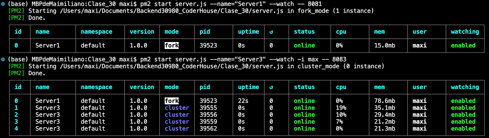
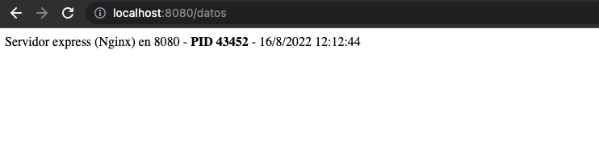

# Desafío Clase 30 - 


## Process Manager - PM2
Para empezar a utilizarlo, se instala:
```
npm install pm2 -g
```

Ejecución genérica:
```
$ pm2 start server.js
```

Modo fork:
```
$ pm2 start server.js --name="ServerX" --watch -- PORT
```

Modo cluster:
```
$ pm2 start server.js --name="ServerX" --watch -i max -- PORT
```

Listar todas las aplicaciones:
```
$ pm2 list
```



Para detener, reiniciar o eliminar:
```
$ pm2 stop/restart/delete server.js
```

## Datos:
Para visualizar los datos de los servidores en el navegador:

