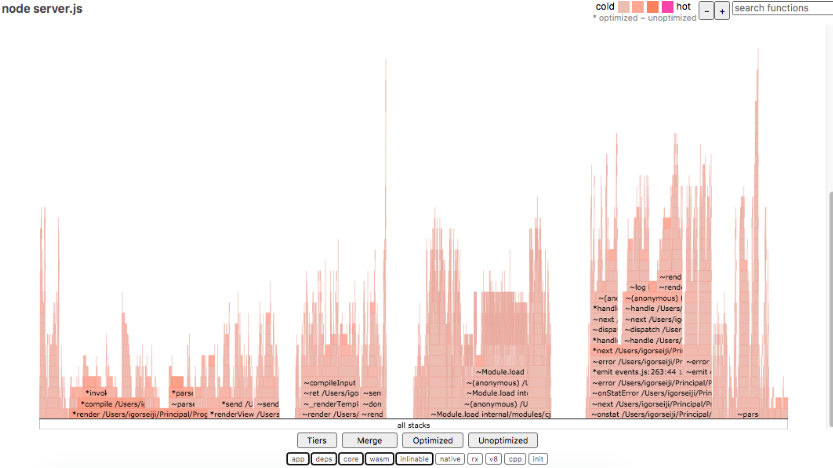
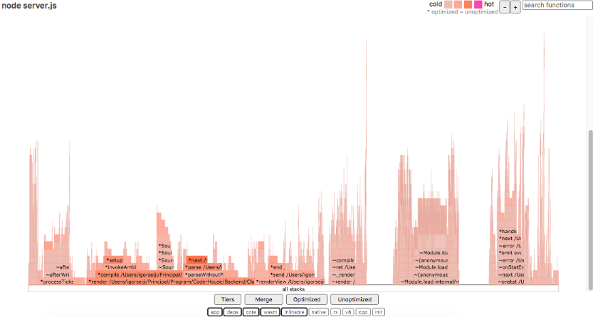

# CoderHouse - Desafio Clase 32

## Loggers y GZIP
Incorporar al proyecto de servidor de trabajo la compresión gzip.
Verificar sobre la ruta /info con y sin compresión, la diferencia de cantidad de bytes.
Luego implementar loggeuo (con alguna librería) que registre:
- Ruta y método de todas las peticiones recibidas por el servidor (info)
- Ruta y método de las peticiones a rutas inexistentes en el servidor (warning)
- Errores lanzados por las apis de mensajes y productos, únicamente (error)

Considerar:
- Loggear todos los niveles a consola
- Registrar sólo los logs de warning en un archivo llamado warn.log [here](logs/warn.log)
- Enviar los logs de error a un archivo llamado error.log [here](logs/error.log)

## Análisis completo de performance
Vamos a trabajar sobre la ruta '/info' en modo fork, agregando o extrayendo un console.log de la información colecata antes de devolverla al Cliente. Además desactivaremos el child_process de la ruta '/randoms'.
Para ambas condiciones (con o sin console.log) en la ruta '/info' OBTENER:
 
1- El perfilamiento del servidor con --prof de node.js. [here](reports/)
 
2- El perfilamiento del servidor con node.js --inspect. [here](reports/)
 
3- El diagrama de flama con 0x
 

 
