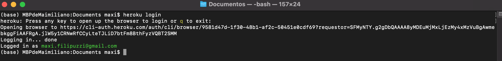
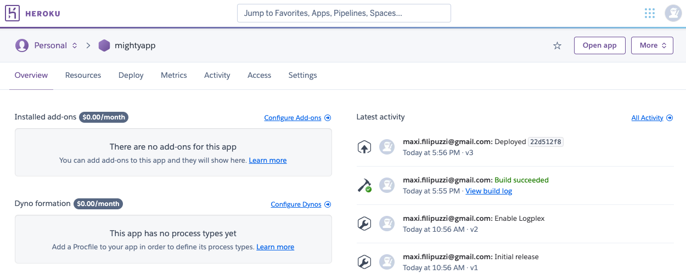
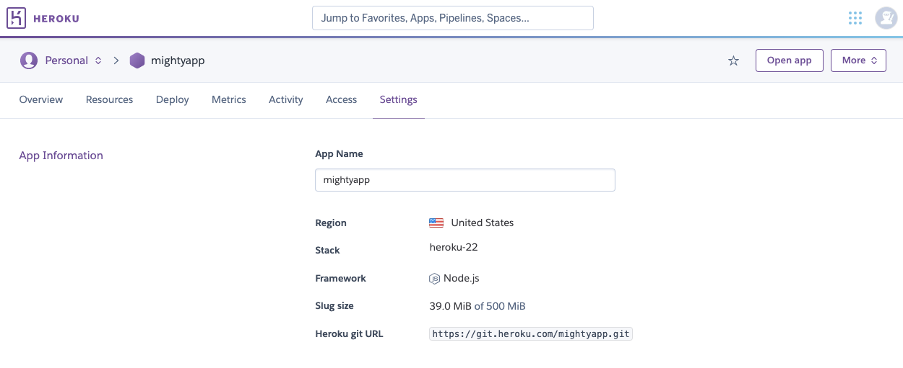
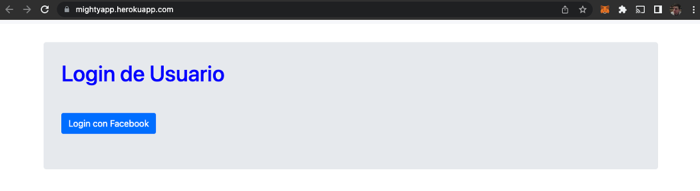

# CoderHouse - Clase 34 - Heroku

## Implementar nuestro proyecto en Heroku

Crear un proyecto en Heroku.com para subir el servidor que venimos realizando, reformando todo lo necesaro para su correcto funcionamiento en la nube. <br>
Subir el código a Heroku.com, sin olvidar incluir el archivo .gitignore para evitar subir los node_modules. Comprobar que el proyecto inicie de manera correcta en la nube. Verificar que en su ruta raíz se encuentre la página pública del servidor. <br>
El servidor debe seguir funcionando en forma local. <br>
Realizar un cambio a elección en alguna vista, probar en forma local y subir nuevamente el proyecto a Heroku, verificando que la nueva reforma esté disponible online. <br>
Revisar a través de una consola local, los mensajes enviados por nuestro servidor en Heroku a su propia consola.

### Install the Heroku CLI

Download Heroku CLI and login:

```
$ heroku login
```



### Create a new Git repository

Initialize a git repository in a new or existing directory

```
$ cd my-project/
$ git init
$ heroku git:remote -a mightyapp
```

### Deploy your application

Commit your code to the repository and deploy it to Heroku using Git.

```
$ git add .
$ git commit -am "make it better"
$ git push heroku master
```

### Existing Git repository
For existing repositories, simply add the heroku remote

```
$ heroku git:remote -a mightyapp
```
<br>


<br>

<br>
