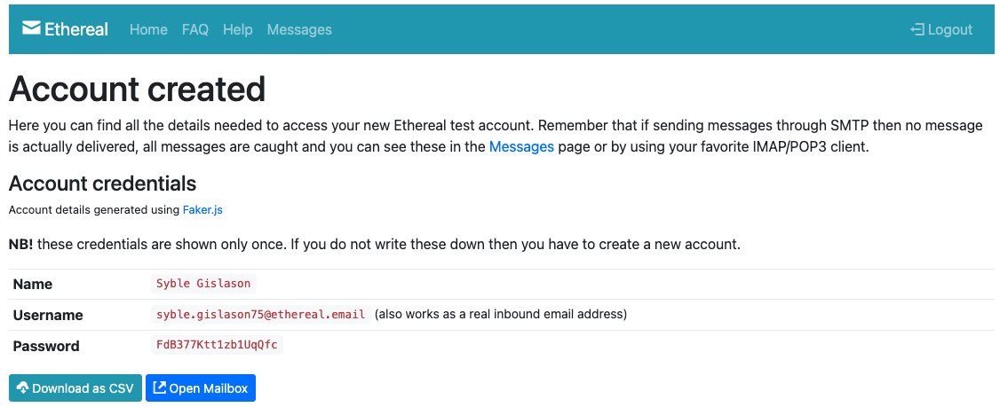
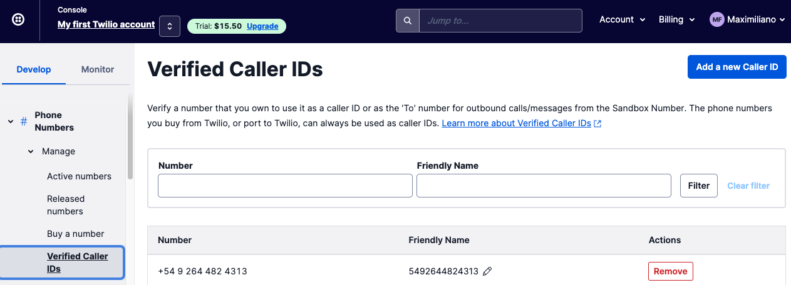
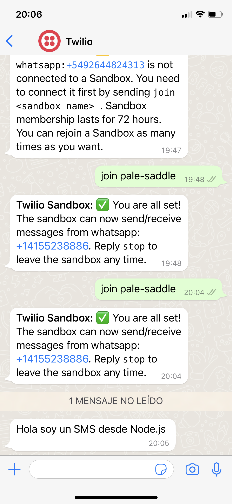
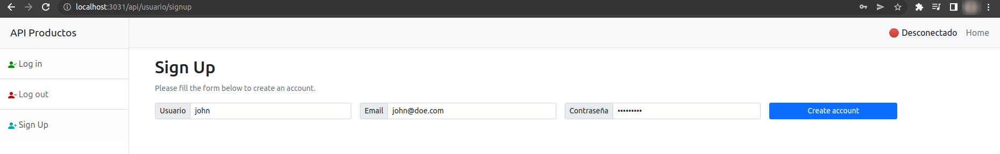
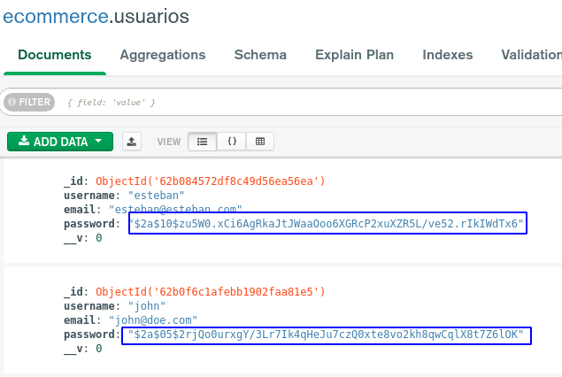
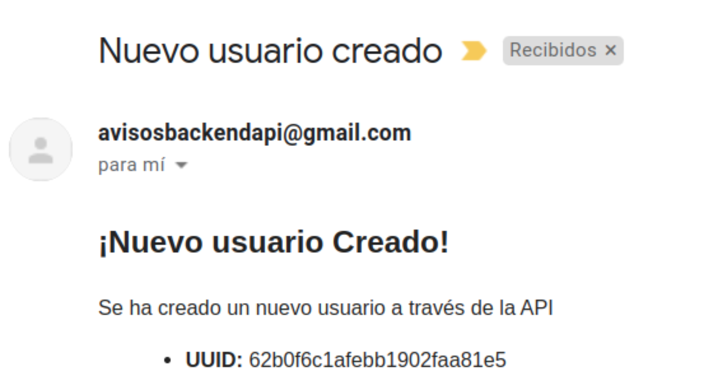
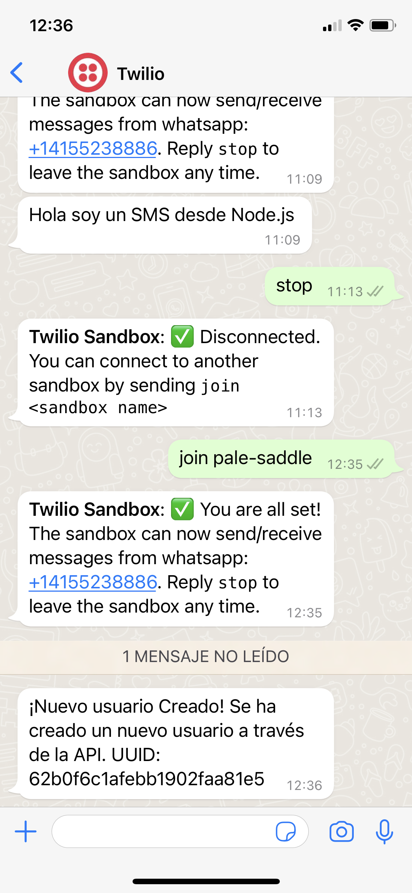

# Clase 36 - Tercer Entrega del Proyecto Final

## Se debe entregar:
- Un menú de registro y autenticación de usuarios basado en passport local, guardando en la
base de datos las credenciales y el resto de los datos ingresados al momento del registro.
- Un formulario post de registro y uno de login. De modo que, luego de concretarse cualquiera de estas operaciones en forma exitosa, el usuario accederá a su home.
- Envío de un email y un mensaje de whatsapp al administrador desde el servidor, a un número de contacto almacenado en una constante global.

## Etapas:

### Creación cuenta de mail de testing (ethereal.email):

Se crea una cuenta para testing:<br>

<br>
Y se procede a su configuración:<br>
<br>
```
const transporter = nodemailer.createTransport({
    host: 'smtp.ethereal.email',
    port: 587,
    auth: {
        user: 'syble.gislason75@ethereal.email',
        pass: 'FdB377Ktt1zb1UqQfc'
    }
});
```
<br>

### Configuración de Twilio:

Se configura Twilio para poder enviar y recibir mensajes de WhatsApp:<br>


<br>

Se envían mensajes de ejemplo (src/notifications/whatsapp/sendWa.js):


<br>

**IMPORTANTE:*** Es importante mantener las credenciales Account SID y Auth Token protegidas.<br>
Para ello, se deben almacenar en variables de entorno o similar, para no ser compartidas o expuestas en GIT.

#### Enviromental variables:
Agrega las variables en un archivo twilio.env y guardalas de la siguiente manera:

```
echo "export TWILIO_ACCOUNT_SID='ACXXXXXXXXXXXXXXXXXXXXXXXXXXXXXXXX'" > twilio.env
echo "export TWILIO_AUTH_TOKEN='your_auth_token'" >> twilio.env
source ./twilio.env
```

Asegurando que sean ignoradas:

```
echo "twilio.env" >> .gitignore
```

## Registro de usuarios y aviso por email de la operación

- Creamos un nuevo usuario



- Observamos que se ha creado un nuevo documento en nuestra base de Mongo, además la contraseña está encriptada



- Recibimos un correo electrónico informando el UUID con el que se ha generado este usuario.



- Recibimos mensaje de WhatsApp con la misma información.

