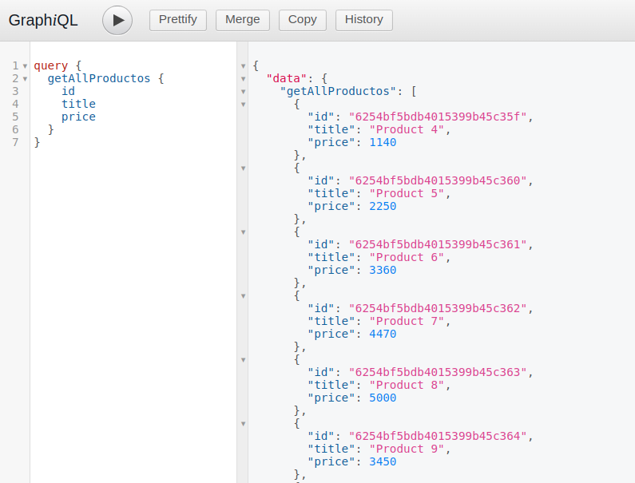

# Clase 44 - GraphQL

## Reformar para usar GraphQL

### Consignas:

- [x] En base al último proyecto entregable de servidor API RESTful, reformar la capa de routeo y el controlador para que los requests puedan ser realizados a través del lenguaje de query GraphQL.
- [x] Si tuviésemos un frontend, reformarlo para soportar GraphQL y poder dialogar apropiadamente con el backend y así realizar las distintas operaciones de pedir, guardar, actualizar y borrar recursos.
- [x] Utilizar GraphQL para realizar la prueba funcional de los querys y las mutaciones.

----

En la carpeta [graphql](src/graphql/), dentro de src se crearon todos los archivos necesarios para utilizar **GraphQL**.

Para acceder a GraphQL ingresa a

### `http://localhost:3031/graphql`

#### Ejemplo de una mutación (crear un nuevo producto)

#### Ejemplo de una query

 
:bulb: **Desarrollador:** Maximiliano Filipuzzi