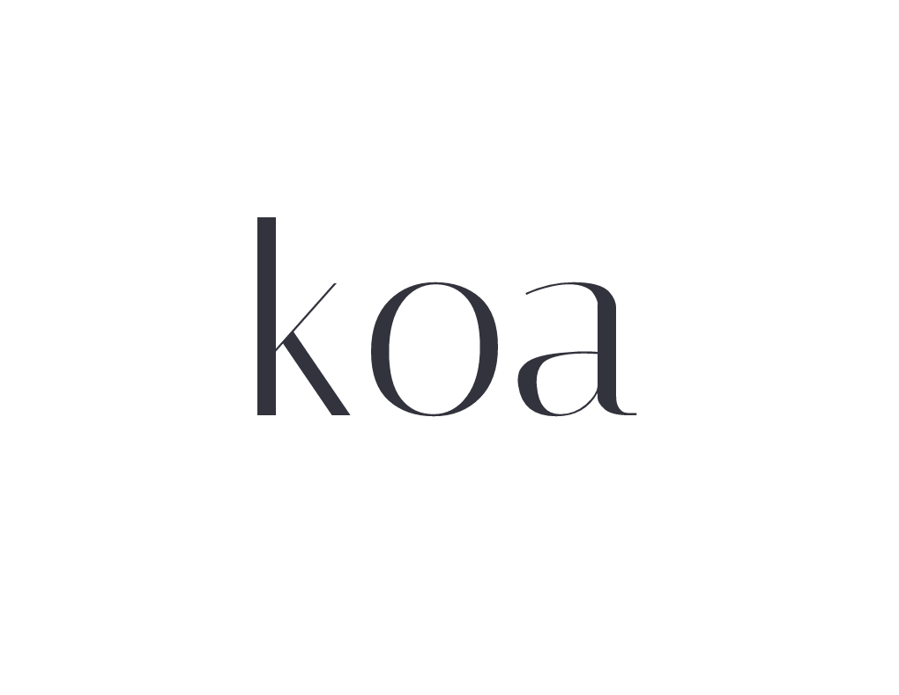

# Clase 46 - Introducción a frameworks de desarrollo Backend - Parte 2


## Reformar para usar otro framework

### Consignas

- [x] Elegir uno de los frameworks vistos en clase y trasladar a esta nueva plataforma el último proyecto entregable (con GraphQL) o al anterior (sin GraphQL).
> Se eligió [Koajs](https://github.com/koajs/koa).
<br>

<br>

*Verificar el correcto funcionamiento del servidor a nivel de sus rutas, vistas, lógica de negocio y persistencia.*

### Funcionamiento

### `npm run dev`

```console

[2022-10-11T20:13:56.088] [INFO] default - 🚀 Server started at http://localhost:6965
[2022-10-11T20:13:56.095] [INFO] default - 🕸️ GraphQL Playground: http://localhost:6965/graphql
[2022-10-11T20:13:56.117] [INFO] default - 🆗 Conectados a MongoDB

```

<br>
:bulb: **Desarrollador:** Maximiliano Filipuzzi