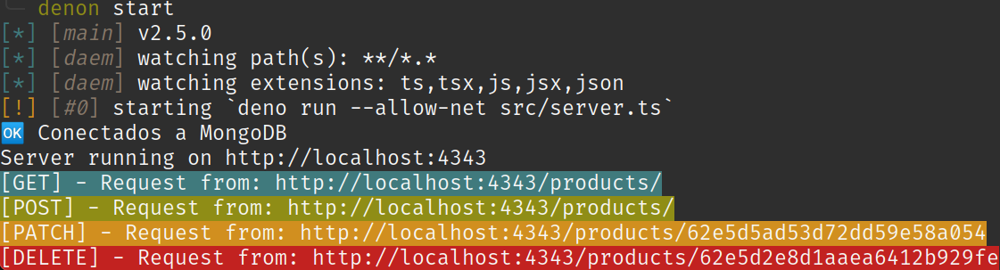

# Clase 47 - El futuro de Nodejs: Deno

## Servidor en Deno

Servidor simple en Deno con persistencia de datos en MongoDB.

Para iniciar scripts.json (cuando estes creando un nuevo proyecto):
#### `denon --init`

Para correr el script que inicia el server, en **Clase_47/**:
#### `denon start`

De acuerdo a cada tipo de petición, se muestra en terminal un color diferente.

 
:bulb: **Desarrollador:** Maximiliano Filipuzzi