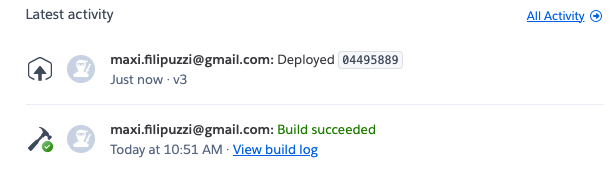

# Entrega de proyecto final

Proyecto final del curso de backend de Coderhouse.
**Comisión:** 30980

## ⭐ Acerca del proyecto


Proyecto backend donde se implementa un API e-commerce para poder vender productos.
<br>
Herramientas utilizadas durante el cursado: <br>


<br>

## 📝 Descripción


- API para manejar productos.
- API para manejar usuarios.
- API para manejar autenticación (login y uso de JWT)
- API para manejar carrito de compras
- Uso de servicios de gmail, WhatsApp y storage para imágenes.
  - gmail para confirmar registro de usuario y venta de carrito.
  - WhatsApp para confirmar venta de carrito.
  - storage para subir photo del usuario.
- MongoDB para persistir la data en producción y la opción de utilizar en memoria para desarrollo.
- Poder habilitar el modo CLUSTER mediante variable de entorno.
- Implementar registro de logs V1 con winston y morgan.
- Trabajar con dependencias typescript y ts-node-dev en vez de Webpack.
- Implementar el proyecto en TypeScript.
- Implementar el proyecto en capas.
  - routes: capa de rutas
  - controllers: capa de controladores
  - business: capa de negocio
  - persistence: capa de persistencia con implementación de repository, dto y dao.


## 📦 Estructura de carpetas


```
├── build
├── logs
├── src
│   ├── business
│   ├── controllers
│   ├── middleware
│   │   ├── errors
│   │   ├── routes
│   │   ├── security
│   │   └── validators
│   ├── persistence
│   │   ├── dao
│   │   │   ├── productDao
│   │   │   ├── shoppingCartDao
│   │   │   └── userDao
│   │   ├── dto
│   │   └── repository
│   ├── routes
│   ├── services
│   │   ├── email
│   │   ├── storage
│   │   └── whatsapp
│   ├── store
│   │   ├── daos
│   │   ├── FileSystem
│   │   ├── firebase
│   │   ├── mongoDb
│   │   │   └── models
│   │   └── types
│   └── types
└── storage

```

## ⚛️ Implementación en Heroku:

Confirmación:


<br>
Se puede encontrar en el siguiente [link](https://backend-final-project-max.herokuapp.com/).

<br>